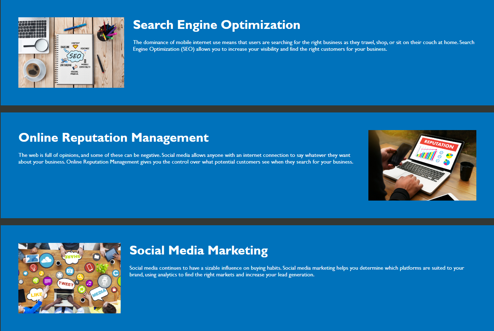

# Semantic-Refractor
# Horiseon Website

This project represents the codebase for the Horiseon website, which focuses on providing information about various digital marketing services. The website is structured using HTML to present content related to Search Engine Optimization (SEO), Online Reputation Management, and Social Media Marketing.

## Table of Contents

- [Description](#description)
- [Usage](#usage)
- [Screenshots](#screenshots)
- [Contributing](#contributing)
- [License](#license)

## Description

The website is designed to showcase the different services offered by Horiseon. It includes sections on SEO, Online Reputation Management, and Social Media Marketing, each containing relevant information and images to illustrate the services offered. The site is constructed using semantic HTML elements for improved readability and accessibility.

## Usage

The website provides information about Horiseon's services. Users can navigate through different sections using the navigation links provided in the header. Clicking on each link scrolls the page to the corresponding section for a more detailed explanation of the service offered.

## Screenshots

*Screenshot of the header and navigation*

*Screenshot of the SEO section*

*Screenshot of the benefits section*

## Contributing

Contributions to this project are currently not accepted as it represents a static representation of the Horiseon website.

## License

This project is licensed under the [MIT License](LICENSE).
